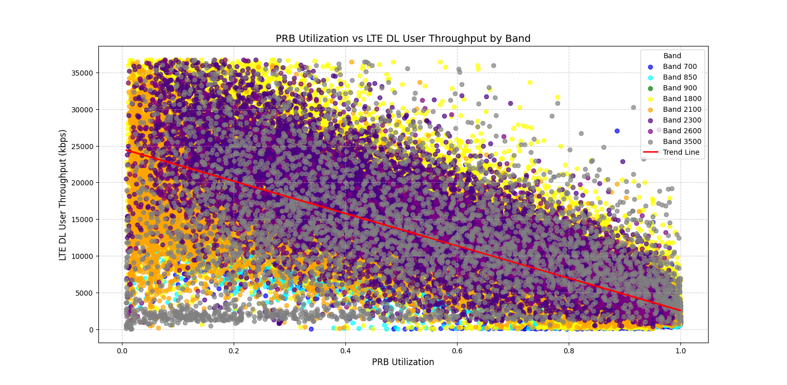

# LTE Download Throughput Predictor API

LTE Download Throughput Predictor API using Machine Learning.

## Summary

This project is a proof-of-concept for a model that predicts the `Download Throughput` of a LTE site, based on the following metrics: `PRB Utilization`, `Payload`, and `RRC Users`.

As seen on this [article](https://www.researchgate.net/figure/The-test-set-LTE-cells-PRB-utilization-vs-average-user-throughput-of-1-busy-hour-Linear_fig3_345446849?fbclid=IwZXh0bgNhZW0CMTEAAR05hot6mKNi2HTGkK5CIhinJhs0J-7AyueSaDXfHjnn_4GZN2Cmrw-hIX8_aem_J7at88cjMh_qC9387ZtV0A&__cf_chl_tk=.LRTE2OXcHhJZaYeivl7qdzXL_CdY094uJ4uepfNQo4-1735223026-1.0.1.1-quTIhVHN8WL2cvbAyZ7WW_58zMGsTYM_8LQncSQwK9Y), Linear correlation is visible, as PRB load increases average user experienced throughput decreasing.This project is a proof-of-concept model designed to predict the `Download Throughput` of an LTE site using the following metrics:
- `PRB Utilization`
- `Payload`
- `RRC Users`

The relationship between these metrics is inspired by findings such as those detailed in [this article](https://www.researchgate.net/figure/The-test-set-LTE-cells-PRB-utilization-vs-average-user-throughput-of-1-busy-hour-Linear_fig3_345446849?fbclid=IwZXh0bgNhZW0CMTEAAR05hot6mKNi2HTGkK5CIhinJhs0J-7AyueSaDXfHjnn_4GZN2Cmrw-hIX8_aem_J7at88cjMh_qC9387ZtV0A&__cf_chl_tk=.LRTE2OXcHhJZaYeivl7qdzXL_CdY094uJ4uepfNQo4-1735223026-1.0.1.1-quTIhVHN8WL2cvbAyZ7WW_58zMGsTYM_8LQncSQwK9Y), which highlights a linear correlation: as `PRB Utilization` increases, the average user throughput decreases.

This relationship is also evident when analyzing real-world LTE site data, as demonstrated in the graph below:



Given this observed correlation, a **Linear Regression** approach was used to train the predictive model.
This relationship is also observed upon analyzing the available real world data for LTE sites, as seen below:

## Deployment

To deploy this project run:

```bash
  docker build . -t lte-dl-throughput-predictor-api
  docker run --name lte-dl-throughput-predictor-api -p 8000:8000 lte-dl-throughput-predictor-api
```


## Authors

- [Engr. Kirk Alyn Santos](https://github.com/kirkalyn13)


## License

[MIT](https://choosealicense.com/licenses/mit/)

